<div align="center">

<h3><code>mahendarreddy08@github ~ $ ./contributions.sh</code></h3>


<br><br>

<h3><code>mahendarreddy08@github ~ $ whoami</code></h3>
<table>
  <tr>
    <td valign="top"></td>
    <td valign="top"></td>
  </tr>
</table>

<br>

<h3><code>mahendarreddy08@github ~ $ ./status.sh</code></h3>

```
📊 9,376+ contributions in the last year
🔧 Full-Stack Developer | Python · JavaScript · React · Node.js · SQL
🌱 Currently building cool stuff with Python & JS
⚡ Always learning, always coding
```

<br>

<details>
<summary><code>mahendarreddy08@github ~ $ ls -la</code></summary>

<br>

| Repository | Description | Stars |
|:-----------|:------------|:-----:|
| [**mahendarreddy08**](https://github.com/mahendarreddy08/mahendarreddy08) | ⚡ My animated GitHub profile | ⭐ |
| _more repos coming soon..._ | | |

</details>

<br>

<p>
  <a href="https://github.com/mahendarreddy08">
    
  </a>
  <a href="https://github.com/mahendarreddy08?tab=repositories">
    
  </a>
</p>

<sub>✨ Profile art generated with Python · Refreshed daily via GitHub Actions ✨</sub>

</div>